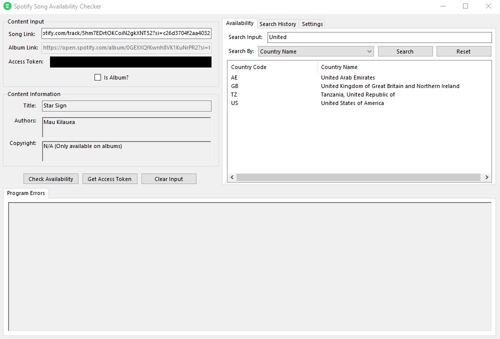
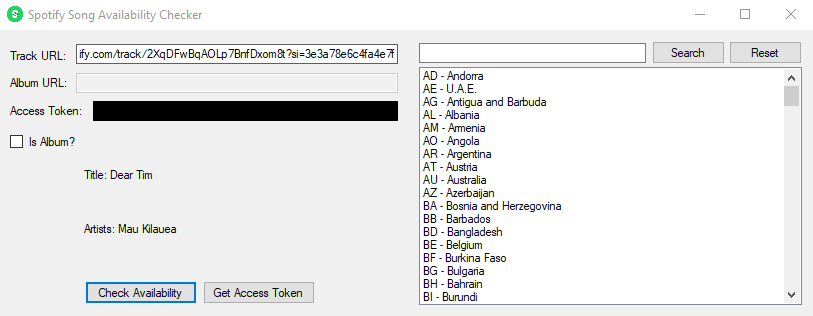
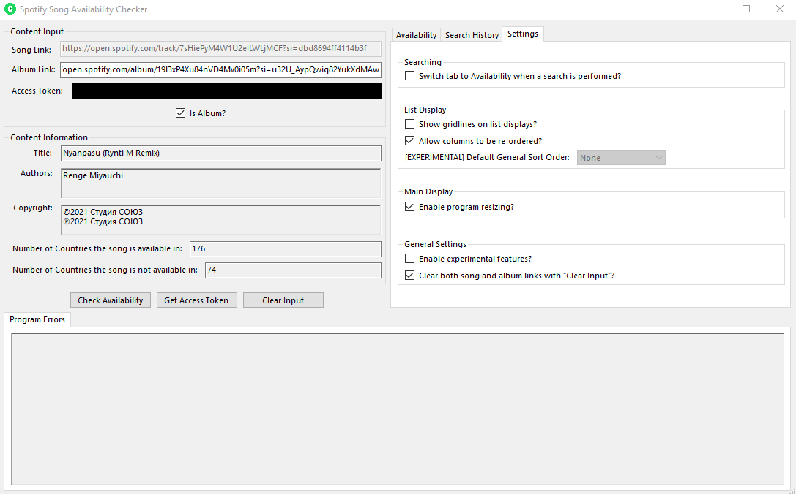

# SpotifySongAvailabilityChecker
A C# program that uses the Spotify API to check song and album availability on Spotify

Features:
- Search track/song and album availability using a URL
- Search for specific languages/regions that have a song available
- Generate an access token to use with the Spotify API
- View past searches and use the URL from them to search again

Note:
- This application does not read, use, or modify any information from the Spotify profile you give it, it will only generate an access token for you to use

Credits:
- [JohnnyCrazy](https://github.com/JohnnyCrazy) - [SpotifyAPI-NET](https://github.com/JohnnyCrazy/SpotifyAPI-NET)

Application:

Application with information entered:

Application with search history with some items and filtered by Author:
